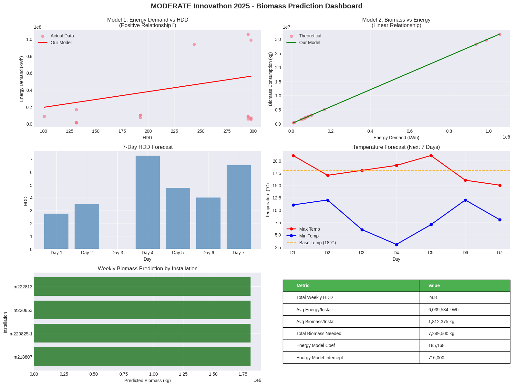
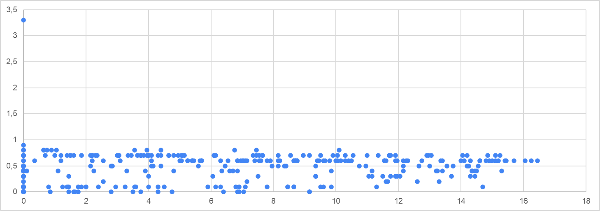

# IDEATHON

## Resolución Problema:

## Jupiter Notebook

https://colab.research.google.com/drive/1OoD4GwjDepkVsrDlWVUWeTW6WDYBgDmz

## Resultado:



### 📋 DELIVERABLES READY:

✓ Jupyter Notebook with machine learning models
✓ AEMET weather integration (with fallback)
✓ Biomass consumption prediction system
✓ Interactive visualization dashboard

### 🎯 KEY RESULTS:

• Total biomass needed next week: 7,249,500 kg
• Average energy per installation: 6,039,584 kWh
• Weekly HDD forecast: 28.8
• Energy model: Energy = 185,168 × HDD + 716,000
• Biomass model: Biomass = 0.3000 × Energy + 500

### 💡 BUSINESS IMPACT:

• Optimized biomass supply chain planning
• Reduced waste through accurate forecasting
• Cost savings from efficient resource allocation
• Data-driven decision making for energy management

## API de Predicción Meteorológica y HDD para 7 días

Este proyecto es un **servicio REST en Spring Boot** que obtiene la predicción meteorológica de los próximos 7 días desde la API de AEMET y calcula los **Heating Degree Days (HDD)** según una fórmula avanzada.

---

### Teoría



## 🔹 Funcionalidad

1. Consulta la predicción de temperatura mínima y máxima para los próximos 7 días de un municipio específico.
2. Calcula el **HDD diario y total** usando una fórmula personalizada basada en la temperatura de referencia (`tBase`).
3. Devuelve toda la información en formato JSON para consumo en otras aplicaciones o frontends.

---

## 🔹 Tecnologías

- Java 11+
- Spring Boot 3.x
- Spring Web
- RestTemplate
- JSON (org.json)

---

## 🔹 Configuración

1. Clona el repositorio:

```bash
git clone https://github.com/jemb4/innovathon.git
cd ideathon
```

🔹 Uso de la API
Obtener temperaturas y HDD

Endpoint:

```bash
GET /api/aemet?municipio={codigoMunicipio}&tBase={temperaturaBase}
```

Parámetros:

Parámetro Descripción Por defecto
municipio Código INE del municipio (ej. 28079 = Madrid) obligatorio
tBase Temperatura de referencia para HDD (°C) 18

Ejemplo:

```bash
curl "http://localhost:8080/api/aemet?municipio=28079&tBase=18"
```

Respuesta JSON ejemplo:

```bash
{
  "municipio": "28079",
  "tBase": 18,
  "hddTotal": 8.25,
  "dias": [
    { "fecha": "2025-10-24", "tMin": 10, "tMax": 16, "hdd": 3.0 },
    { "fecha": "2025-10-25", "tMin": 11, "tMax": 17, "hdd": 2.25 },
    { "fecha": "2025-10-26", "tMin": 12, "tMax": 20, "hdd": 3.0 }
  ]
}
```

🔹 Cómo funciona el cálculo de HDD

Se calcula HDD diario según esta fórmula:

Si tMax < T_BASE: HDD = T_BASE - tAvg

Si tAvg < T_BASE < tMax: HDD = ((T_BASE - tMin)/2) - ((tMax - T_BASE)/4)

Si tMin < T_BASE < tAvg: HDD = (T_BASE - tMin)/4

Si tMin ≥ T_BASE: HDD = 0

El HDD total es la suma de los valores diarios.

🔹 Notas

Asegúrate de no exceder los límites de la API de AEMET.

Para desarrollo local puedes cambiar la rama en GitHub y probar el push sin afectar el main.
